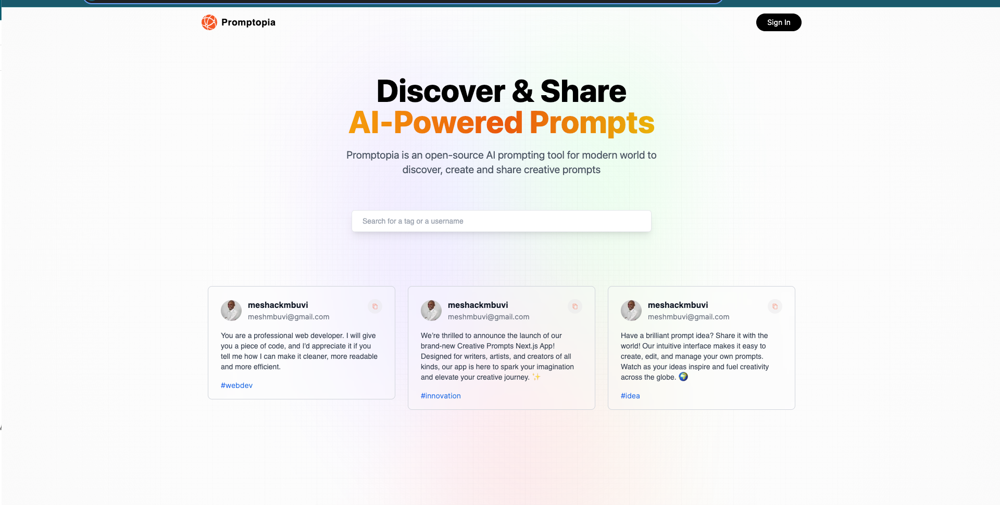

Certainly! Here's a `README.md` file for your Next.js app:

````markdown
# Creative Prompts App

Welcome to the Creative Prompts App! This Next.js application allows users to create, manage, and explore creative prompts. The app leverages MongoDB for database management, React.js for the frontend, and NextAuth.js with Google for authentication.

## Features

- Create, edit, and delete creative prompts
- User authentication with Google using NextAuth.js
- Responsive and interactive UI with React.js
- Secure and efficient data storage with MongoDB

## Technologies Used

- [Next.js](https://nextjs.org/) - A React framework for server-side rendering and generating static websites
- [React](https://reactjs.org/) - A JavaScript library for building user interfaces
- [Tailwind CSS](https://tailwindcss.com/) - A utility-first CSS framework for rapid UI development

## Table of Contents

- [Installation](#installation)
- [Configuration](#configuration)
- [Running the App](#running-the-app)
- [Contributing](#contributing)
- [License](#license)

## Installation

1. Clone the repository:

```bash
git clone https://github.com/meshack_mbuvi/creative-prompts-app.git
cd creative-prompts-app
```
````

2. Install dependencies:

```bash
npm install
```

## Configuration

1. Create a `.env.local` file in the root directory of the project and add the following environment variables:

```plaintext
MONGODB_URI=<your-mongodb-connection-string>
NEXTAUTH_URL=http://localhost:3000
GOOGLE_CLIENT_ID=<your-google-client-id>
GOOGLE_CLIENT_SECRET=<your-google-client-secret>
```

2. Replace the placeholders with your actual MongoDB connection string and Google OAuth credentials.

## Running the App

1. Start the development server:

```bash
npm run dev
```

2. Open [http://localhost:3000](http://localhost:3000) in your browser to see the app.

## Contributing

Contributions are welcome! If you'd like to contribute, please follow these steps:

1. Fork the repository.
2. Create a new branch: `git checkout -b feature/your-feature-name`
3. Make your changes and commit them: `git commit -m 'Add some feature'`
4. Push to the branch: `git push origin feature/your-feature-name`
5. Submit a pull request.

## TODO:

[ ] Implement search

- Search by prompt
- Search by tag
- Search by username

[ ] ImplementClick on tag

[ ] Implement View other profiles

## Screenshot


## License

This project is licensed under the MIT License.

---

Feel free to reach out if you have any questions or need further assistance.

Happy coding!

Meshack Mbuvi

```

This `README.md` file provides a clear overview of the project, instructions for setting up the environment, and guidelines for contributing. Adjust any details as needed to fit your specific project setup.
```
